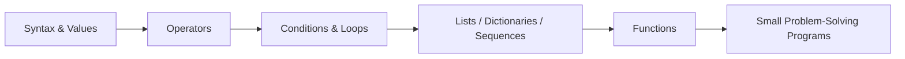

<div align="center">

# 🐍 Python Programming Lab

### Structured Python Fundamentals, Data Types, Operators, Functions & Algorithm Practice

**Python Programming Lab** is a growing collection of focused Python exercises designed to build strong programming fundamentals through small, readable examples. The repository covers core syntax, operators, built-in data structures, loops, functions, and beginner problem-solving programs such as Fibonacci generation and number checks.

<p align="center">
  
  
  
</p>

</div>

---

## 📚 What This Repository Covers

| Area | Example Files / Concepts |
|---|---|
| 🔢 Data Types | Boolean, bytes, lists, dictionaries and sequence operations |
| ⚙️ Operators | Assignment, bitwise and logical operators |
| 🔁 Control Flow | Loops, conditions, even/odd checks and digit-based exercises |
| 🧩 Functions | Function definitions, parameters and reusable logic |
| 📦 Collections | List and dictionary methods in greater depth |
| 🧠 Problem Solving | Fibonacci series, summation and small algorithmic exercises |

## 🧭 Learning Flow



## 🚀 Run an Exercise

```bash
git clone https://github.com/shreeharsh-patil/Python.git
cd Python
python fibonacci_series.py
```

Replace `fibonacci_series.py` with any script you want to study or execute.

> [!TIP]
> Read the source first, predict the output, then run the script. This makes the repository more useful as a learning lab rather than just a collection of answers.

## 📁 Repository Style

Each topic is generally kept in its own `.py` file, making individual concepts easy to locate, run, modify, and compare.

```text
Python/
├─ assignment_operators.py
├─ bitwise_operators.py
├─ boolean_datatype.py
├─ builtin_funcs_seq.py
├─ dict_datatype.py
├─ dict_depth_methods.py
├─ fibonacci_series.py
├─ functions_concepts.py
├─ list_datatype.py
├─ list_depth_methods.py
└─ ...more focused Python exercises
```

## 🎯 Purpose

This repository is intended for Python practice, revision, lab preparation, and building confidence with programming fundamentals before moving to larger applications and algorithms.

## 👤 Project Author

Developed and maintained by **Shreeharsh Patil**.

- **Email:** shreeharsh.dev@gmail.com
- **GitHub:** [github.com/shreeharsh-patil](https://github.com/shreeharsh-patil)
